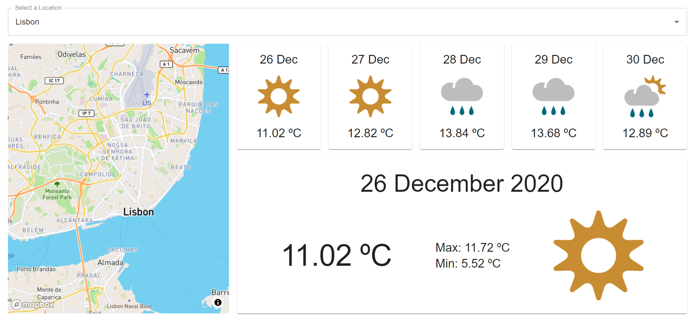

My "Weather App" consists of an [SPA](https://en.wikipedia.org/wiki/Single-page_application) that will display the current forecast details and the next few days' forecast for a selected location.

Users should be allowed to search for a location. This search will guide the users, displaying possible locations containing the users' query as he types.

Upon selecting a location, he/she should be able to check the forecast for the next 5 days and the details of today's weather report.

The app relies on [MetaWeather](https://www.metaweather.com/api/)'s data. It provides endpoints to search for a location from a provided query string and another to fetch the weather report of a location, through its [WOEID](https://en.wikipedia.org/wiki/WOEID) - _Where on Earth ID_.

| Solution | Usefulness |
| :- | :- |
| [Moment.js](https://momentjs.com/) | Parse, validate, manipulate, and display dates and times in JavaScript. |
| [Material-UI](https://material-ui.com/) | React components for faster and easier web development. |
| ~~[Local CORS Proxy](https://github.com/garmeeh/local-cors-proxy#readme)~~ | ~~Simple proxy to bypass CORS issues. This was built as a local dev only solution to enable prototyping against existing APIs without having to worry about CORS.~~ |
| [CORS Anywhere](https://github.com/Rob--W/cors-anywhere/#documentation) | CORS Anywhere is a NodeJS proxy which adds CORS headers to the proxied request. |
| [React Mapbox GL](https://github.com/alex3165/react-mapbox-gl) + [Mapbox GL JS](https://docs.mapbox.com/mapbox-gl-js/api/) | React wrapper for Mapbox GL JS - a JavaScript library that uses WebGL to render interactive maps from vector tiles and Mapbox styles. |
